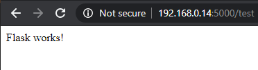

# Setting up the BBB from scratch
## Flash Debian onto the board
Use the [instructions on the beagleboard website](https://beagleboard.org/getting-started).

The process is fairly simple, but takes some time. Last tested version is AM3358 Debian 10.3 2020-04-06 4GB SD IoT.

You will need:
- A computer
- A USB micro B cable
- An SD card reader for your computer
- Approximately an hour of your time


## Install libraries
Because Python2 has been deprecated since Jan 1, 2020, Python3 is used in this project. You must run everything using `python3`. If you find issues and see that something is run using just `python`, your first action should be to use Python3.

* The board must have internet access for successful library installation!
* From here on out, we will use 192.168.7.2 as the IP address of the board, but this may not be the case when you are working with it. Use instructions for your system to find the IP address of the BBB connected to your computer and replace the default address if necessary in the following instructions.
* If Adafruit_BBIO is missing (it shouldn't be), following the [Adafruit installation instructions](https://learn.adafruit.com/setting-up-io-python-library-on-beaglebone-black/installation-on-ubuntu).
* Using the terminal or PowerShell, copy the helloworld folder to the BBB with the command `scp -rp .\BBB\helloworld\ debian@192.168.7.2:~/`. This folder contains this file and files referenced here that will allow you to test if libraries installed correctly.


### Install Protobuf and gRPC
* `sudo pip3 install protobuf`
* `sudo pip3 install grpcio`
* `sudo pip3 install grpcio-tools`
* Test by running `python3 helloworld/greeter_server.py ` in one terminal and `python3 helloworld/greeter_client.py` in another, in that order. If you see  `Greeter client received: Hello, you!`, everything installed correctly and you may proceed.

### Install Flask
* `sudo pip3 install Flask`
* Test by running `python3 helloworld/Flask-tester.py `. Navigate to http://192.168.7.2:5000/test. You've succeded if you see: 
  * Ignore what the print statement says about the server running on http://0.0.0.0:5000/. That just means that it is running on the same address as the board itself.

### Install serial
`sudo pip3 install pyserial`
* Test by running `python3 helloworld/testSerial.py `.
  * If you see the following, the serial was opened previous and incorrectly closed. The only solution we found to this is to reboot the board (`sudo reboot now`).
    ```
    File "/home/debian/.local/lib/python3.7/site-packages/serial/serialposix.py", line 261, in open
      raise SerialException("Port is already open.")
    serial.serialutil.SerialException: Port is already open.
  ```

# You are done and may now proceed to development!
Check out the README.md file in the root directory. It will point in you the right direction for development on this project.